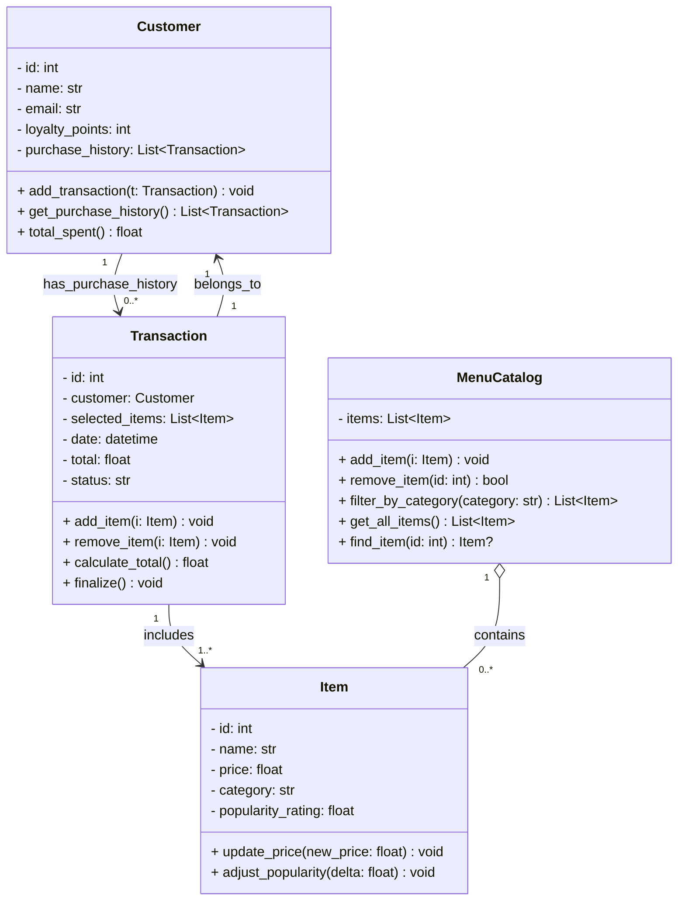

@bytebites_spec.md contains the spec for this project

---

The following is an improved Mermaid.js class diagram that codifies how classes should be structured for this project. The revision adds clearer attributes, explicit types, common helper methods, and a few practical fields (ids, timestamps, basic status methods) to make implementation and testing easier.

Notes:
- Added `id`, `email`, and `loyalty_points` to `Customer` to support identification and simple loyalty features.
- Added `id`, `update_price`, and `adjust_popularity` to `Item` to support catalog operations and tests.
- Made `MenuCatalog` capable of removing and finding items by `id` to aid runtime management.
- Expanded `Transaction` with `date`, `total`, and `status`, plus `remove_item` and `finalize()` to reflect realistic order lifecycle.