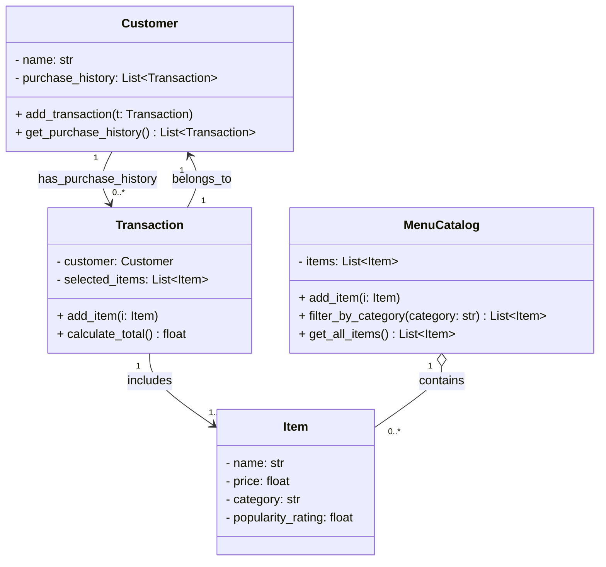

@bytebites_spec.md contains the spec for this project

---

The following is a Mermaid.js class diagram that codifies how classes should be structured for this project.

```mermaid
classDiagram
    class Customer {
        - name: str
        - purchase_history: List~Transaction~
        + add_transaction(t: Transaction)
        + get_purchase_history() List~Transaction~
    }
    class Item {
        - name: str
        - price: float
        - category: str
        - popularity_rating: float
    }
    class MenuCatalog {
        - items: List~Item~
        + add_item(i: Item)
        + filter_by_category(category: str) List~Item~
        + get_all_items() List~Item~
    }
    class Transaction {
        - customer: Customer
        - selected_items: List~Item~
        + add_item(i: Item)
        + calculate_total() float
    }

    Customer "1" --> "0..*" Transaction : has_purchase_history
    Transaction "1" --> "1" Customer : belongs_to
    Transaction "1" --> "1..*" Item : includes
    MenuCatalog "1" o-- "0..*" Item : contains
```